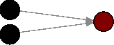
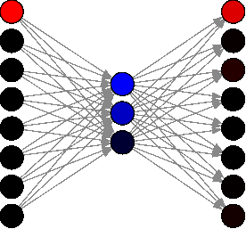
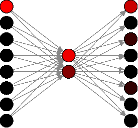
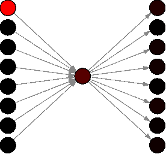
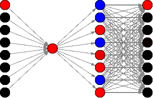

# Kerasimo
Plot neural networks generated by the Deep Learning library Keras

This repository contains a small library to plot neural networks generated by the library [Keras](https://keras.io)
originally created for a talk. Feel free to use the library or use the images provided.

### OR

### AND

### Insufficient network for XOR

### XOR

### Encode to three neurons (learn binary)

### Encode to two neurons

### Encode insufficient to one neurons

### Encode to one neurons with additional layer

### Digits

### Digits Convoluted Neural Network

### Written Digits Neural Network trained with MNIST database

### Generative Adversarial Network (GAN) trained on the MNIST database

### Game Snake trained on an convoluted neural network

